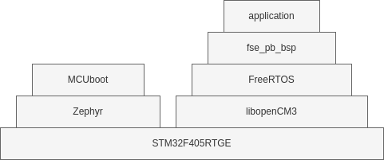

# fse_pb_bsp

Board support library (STM32F405RTGE) used across the StarkStrom Augsburg Driverless control units.

## Creating a new project

```shell
mkdir my_project
cd my_project

git submodule add git@github.com:StarkStrom-Driverless/fse_pb_bsp.git

# checkout the version you want to build against
cd fse_pb_bsp
git checkout <version>

./init.sh

cd ..
```

`init.sh` scaffolds `usr/src`, `usr/inc`, copies the starter `main.c`/`Makefile`/`.gitignore`/`FreeRTOSConfig.h`/`ss_config.h` from `fse_pb_bsp/test`, builds `libopencm3`, creates the `./ss` symlink (-> `fse_pb_bsp/tools/ss`) and sets up a Python venv with everything the tooling needs (`python-can`, `telnetlib3`, `cryptography`, `intelhex`, ...).

## Init a project

If the project already exists (freshly cloned, or `fse_pb_bsp` was bumped to a new version), re-run the same steps against the existing checkout:

```shell
cd my_project

git submodule update

cd fse_pb_bsp
git checkout <version>

./init.sh

cd ..
```

`init.sh` is safe to re-run - it only copies the starter files if they don't already exist (`cp -n`) and only recreates the `./ss` symlink/venv if missing.

## Building

All build/flash/debug actions go through the `./ss` tool. Source the venv once per terminal session first:

```shell
source .venv/bin/activate
```

Running `./ss` with no arguments prints the full command overview. The main ones:

| Command | Purpose |
|---|---|
| `./ss build` | build the main firmware (`build/bp_test.elf`) |
| `./ss clean` | clean the main firmware's build output |
| `./ss flash` | build + sign + flash the main firmware via OpenOCD/telnet |
| `./ss canflash --bin_file <path> --id <hex id>` | flash a signed `.bin` over CAN |
| `./ss bootloader --bin_file <path> --position <addr>` | flash a bootloader image (e.g. `zephyr.bin`) |
| `./ss oocd_start` / `./ss oocd_stop` / `./ss oocd_state` | manage the OpenOCD server (`make gdb` then gives you a GDB TUI) |

### Peripheral examples

`fse_pb_bsp/examples/` contains one minimal, single-purpose `.c` file per peripheral (see `Creating a new example` below for how they're wired up). They're built independently from the main firmware and don't need `usr/`:

| Command | Purpose |
|---|---|
| `./ss example_list` | list all available examples |
| `./ss example_build <name>` | build one example, e.g. `./ss example_build adc` -> `fse_pb_bsp/examples/build/adc.elf` |
| `./ss flash_example <name>` | build + sign + flash one example via OpenOCD/telnet |

`example_build`/`flash_example` also print the path to the example's `.c` source file, so you can jump straight to it.

You can also build examples directly with `make`, without going through `./ss`:

```shell
cd fse_pb_bsp/examples
make adc      # -> fse_pb_bsp/examples/build/adc.elf
make clean    # remove fse_pb_bsp/examples/build
```

## Creating a new example

Adding a new peripheral example is just two steps:

1. Add `fse_pb_bsp/examples/<name>.c`. Keep it minimal - `ss_init()`, the peripheral-specific init/task, `ss_error_fail()` and `vApplicationStackOverflowHook()`:

```c
#include "ss.h"

void example_task(void* args) {
    for (;;) {
        // ...
        ss_rtos_delay_ms(500);
    }
}

int main(void) {
    SS_ERROR_ASSERT(ss_init());

    // peripheral-specific SS_ERROR_ASSERT(ss_..._init(...)) calls go here

    SS_ERROR_ASSERT(ss_rtos_task_add(example_task, NULL, 1, "example_task"));

    ss_rtos_start();

    while (1) {
    }

    return 0;
}

void ss_error_fail(void) {
    while (1) {
        ss_led_error_toggle();
        ss_delay(1000);
    }
}

void vApplicationStackOverflowHook(TaskHandle_t xTask, char * pcTaskName) {
    while(1) {
        ss_led_error_toggle();
        ss_delay(500);
    }
}
```

2. Add `<name>` to the `EXAMPLES` list in `fse_pb_bsp/examples/Makefile`.

That's it - `make <name>`, `./ss example_build <name>` and `./ss example_list` all pick it up automatically (the object files are shared with the main firmware build, so nothing needs to be compiled twice).

If the example needs its own pin(s), add a `EXAMPLE_<NAME>_PIN` define to `fse_pb_bsp/examples/pins.h` rather than hardcoding `PIN(...)` in the example itself.

# Overview

In this chapter, an overview of the system is presented.



The `fse_pb_bsp` library is built on several third-party components. At the foundation lies the STM32F405RTGE microcontroller.

Because the library depends on the MCU bootloader, the figure shows two pyramids: the left pyramid represents the bootloader stack, while the right pyramid shows the application stack.

The bootloader is based on Zephyr, a powerful embedded operating system. It includes MCUboot, a secure bootloader. For this purpose, a separate repository called `fse_pb_bootloader` exists. Once the bootloader has been successfully compiled and flashed onto the processor board, it usually does not need to be flashed again.

The bootloader requires the following memory layout:

* Bootloader partition
* Slot0 partition
* Slot1 partition

If a valid and correctly signed image is written to the Slot1 partition, the bootloader will swap Slot0 with Slot1 before continuing execution. By default, the bootloader operates from Slot0.

The right side of the pyramid is based on the libopencm3 library, a low-level configuration library for various microcontroller platforms. On top of this, the custom-developed `fse_pb_bsp` library provides an abstraction layer for controller configuration. Additionally, `fse_pb_bsp` relies on FreeRTOS, as it also abstracts the use of the RTOS.

Finally, on top of this stack, the actual application can be developed.

# Pin capabilities

### GPIOA
|PIN| GPIO|PWM|CAN|SPI1|SPI2|SPI3|UART|ADC
|-|-|-|-|-|-|-|-|-|
|PA0|True|True||||||True
|PA1|True|True||||||True
|PA2|True|True|||||UART2_Tx|True
|PA3|True|True|||||UART2_Rx|True
|PA4|True|||SPI1_NSS||SPI3_NSS||True
|PA5|True|True||SPI1_SCK||||True
|PA6|True|True||SPI1_MISO||||True
|PA7|True|True||SPI1_MOSI||||True
|PA8|True|True|||||||
|PA9|True|True|||||UART1_Rx||
|PA10|True|True|||||UART1_Tx||
|PA11|True|True|||||||
|PA12|True||||||||
|PA13|||||||||
|PA14|||||||||
|PA15|True|True||SPI1_NSS||SPI3_NSS|||

### PORTB
|PIN| GPIO|PWM|CAN|SPI1|SPI2|SPI3|UART|ADC
|-|-|-|-|-|-|-|-|-|
|PB0|True|True||||||True
|PB1|True|True||||||True
|PB2|||||||||
|PB3||||SPI1_SCK||SPI3_SCK|||
|PB4|||STB2|SPI1_MISO||SPI3_MISO|||
|PB5|||RX2|SPI1_MOSI||SPI3_MOSI|||
|PB6|||TX2||||||
|PB7|||STB1||||||
|PB8|||RX1||||||
|PB9|||TX1||SPI2_NSS||||
|PB10|True|True|||SPI2_SCK||UART3_Rx - UART4_Rx||
|PB11|True|True|||||UART3_Tx||
|PB12|True||||SPI2_NSS||||
|PB13|True||||SPI2_SCK||||
|PB14|True|True|||SPI2_MISO||||
|PB15|True|True|||SPI2_MOSI||||

### PORTC
|PIN| GPIO|PWM|CAN|SPI1|SPI2|SPI3|UART|ADC
|-|-|-|-|-|-|-|-|-|
|PC0|||||||||
|PC1|||||||||
|PC2|True|||||||True
|PC3|True|||||||True
|PC4|||||||||
|PC5|||||||||
|PC6|True|True|||||UART6_Rx||
|PC7|True|True|||||UART6_Rx||
|PC8|True|True|||||||
|PC9|True|True|||||||
|PC10|True|||||SPI3_SCK|||
|PC11|True|||||SPI3_MISO|UART4_Tx||
|PC12|True|||||SPI3_MOSI|||
|PC13|True||||||||
|PC14|True||||||||
|PC15|True||||||||

# Install

Tested on a Linux based system - this won't work on Windows directly, try WSL2 instead. You may still run into trouble flashing from WSL2 (USB passthrough); in that case a release binary flashed directly via st-link from the derived control-unit repository is the fallback.

## Ubuntu

```shell
sudo apt install binutils-arm-none-eabi gcc-arm-none-eabi
sudo apt install gdb-multiarch
cd /usr/bin
sudo ln -s gdb-multiarch arm-none-eabi-gdb

# Download arm-gnu-toolchain-14.3.rel1-x86_64-arm-none-eabi.tar.xz from
# https://developer.arm.com/downloads/-/arm-gnu-toolchain-downloads

cd /opt
sudo tar Jxvf ~/Downloads/arm-gnu-toolchain-14.3.rel1-x86_64-arm-none-eabi.tar.xz

# add to .bashrc
export PATH=$PATH:/opt/arm-gnu-toolchain-14.3.rel1-x86_64-arm-none-eabi/bin

source .bashrc

sudo add-apt-repository ppa:deadsnakes/ppa
sudo apt update
sudo apt install python3.8

sudo apt install openocd

sudo cp /lib/udev/rules.d/60-openocd.rules /etc/udev/rules.d/

sudo reboot

sudo apt install can-utils
```

## Fedora

```shell
sudo dnf install arm-none-eabi-binutils-cs gdb openocd can-utils xz git make

# create a sym link from gdb to arm-none-eabi-gdb
sudo ln -s gdb gdb-multiarch

# Download arm-gnu-toolchain-15.2.rel1-x86_64-arm-none-eabi.tar.xz from
# https://developer.arm.com/downloads/-/arm-gnu-toolchain-downloads

cd /opt
sudo tar Jxvf ~/Downloads/arm-gnu-toolchain-15.2.rel1-x86_64-arm-none-eabi.tar.xz

export PATH=$PATH:/opt/arm-gnu-toolchain-15.2.rel1-x86_64-arm-none-eabi/bin

sudo cp /lib/udev/rules.d/60-openocd.rules /etc/udev/rules.d/
```
